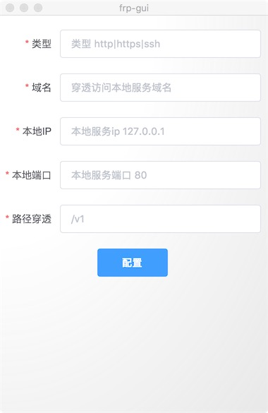

# frp-gui


> 基于[frp](https://github.com/fatedier/frp/releases/tag/v0.20.0)二进制包，使用electron打包成的Mac本地网络穿透，图形操作app.解决本地开发网络环境问题。

#### Build Setup

``` bash
# install dependencies
npm install

# serve with hot reload at localhost:9080
npm run dev

# build electron application for production
npm run build
```
# 环境搭建
1. 下载[frp](https://github.com/fatedier/frp/releases/tag/v0.20.0)对应的版本。目前我采用的是v0.20.0,需要自行构建的只要替换frp 文件夹中的二进制包即可。本地frpc 和 服务端版本要一直。
2. 服务端frps配置

```
[common]
bind_port = 7000
vhost_http_port = 8080
log_file = /home/log/frps.log

```

fpc.ini配置

```
[common]
server_addr=服务器ip
server_port=7000
log_file=/usr/local/var/log/frpc.log
login_fail_exit=false
```

[更多配置项](https://github.com/fatedier/frp#example-usage)

3.配置好，构建生成app。点击配置要穿透的本地服务，重启app即可通过域名访问本地服务。


---

This project was generated with [electron-vue](https://github.com/SimulatedGREG/electron-vue)@[4c6ee7b](https://github.com/SimulatedGREG/electron-vue/tree/4c6ee7bf4f9b4aa647a22ec1c1ca29c2e59c3645) using [vue-cli](https://github.com/vuejs/vue-cli). Documentation about the original structure can be found [here](https://simulatedgreg.gitbooks.io/electron-vue/content/index.html).
